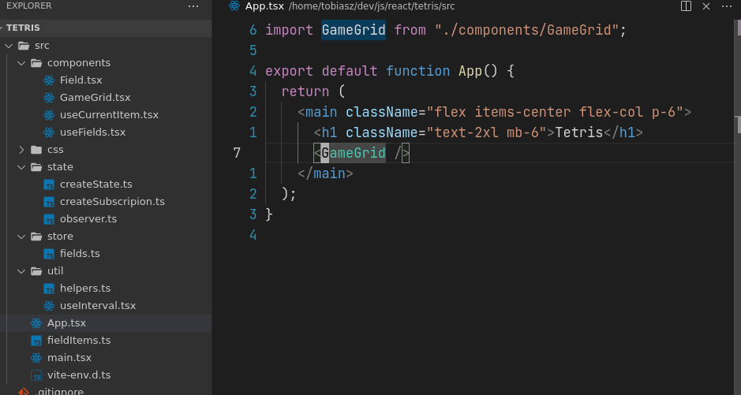

<div align="center">

# VS Code Harpoon

VS Code Harpoon is inspired by The Primeagen's [Harpoon](https://github.com/ThePrimeagen/harpoon)
plugin for neovim. It supports the basic use case of file navigation just like with Harpoon.


[](https://opensource.org/licenses/MIT)

</div>

## Features

VSCode Harpoon is a file navigation tool, which lets you mark editors and jump to your marked
editors.

When adding your first editor, it will be set as `editor 1`, the next `editor 2` and so on.

You are then able to jump to `editor 1` or `editor 2` from anywhere in your workspace.



### Available Commands

- `VSCode Harpoon: Add Editor (vscode-harpoon.addEditor)` adds the current editor to your workspace
- `VSCode Harpoon: Go to editor [1-9] (vscode-harpoon.gotoEditor[1-9])` Goes to workspace editor
  [1-9]
- `VSCode Harpoon: Edit Editors (vscode-harpoon.editEditors)` Opens an editor for you do delete or
  move added editors around.
- `VSCode Harpoon: Add Global Editor (vscode-harpoon.addGlobalEditor)` adds the current editor
  globally
- `VSCode Harpoon: Go to global editor [1-9] (vscode-harpoon.gotoGlobalEditor[1-9])` Goes to global
  editor [1-9]
- `VSCode Harpoon: Edit Global Editors (vscode-harpoon.editGlobalEditors)` Opens an editor for you
  do delete or move added editors around.

## Example Keybinds

### VSCode (`keybindings.json`)

```json
[
  {
    "key": "alt+a",
    "commands": ["vscode-harpoon.addEditor"]
  },
  {
    "key": "alt+e",
    "commands": ["vscode-harpoon.editEditors"]
  },
  {
    "key": "alt+1",
    "command": "vscode-harpoon.gotoEditor1"
  }
]
```

### VSCode Vim (`settings.json`)

```json
{
  "vim.leader": " ",
  "vim.normalModeKeyBindings": [
    {
      "before": ["<leader>", "a"],
      "commands": ["vscode-harpoon.addEditor"]
    },
    {
      "before": ["<leader>", "e"],
      "commands": ["vscode-harpoon.editEditors"]
    },
    {
      "before": ["<leader>", "1"],
      "commands": ["vscode-harpoon.gotoEditor1"]
    }
    // ...
  ]
}
```

---

## Issues

Looking to contribute? Please read the `CONTRIBUTING.md` file, which contains information about
making a PR.

Any feedback is very appreciated!

### 🪲 Bugs

Please file an issue for bugs, missing documentation, unexpected behavior etc.

[**Create bug report**](https://github.com/tobias-z/vscode-harpoon/issues/new?assignees=&labels=&template=bug_report.md&title=)

### 🕯 Feature Requests

Please file an issue to suggest new features. Vote on feature requests by adding a 👍.

[**Create Feature Requests**](https://github.com/tobias-z/vscode-harpoon/issues/new?assignees=&labels=&template=feature_request.md&title=)

## Following extension guidelines

Ensure that you've read through the extensions guidelines and follow the best practices for creating
your extension.

- [Extension Guidelines](https://code.visualstudio.com/api/references/extension-guidelines)
